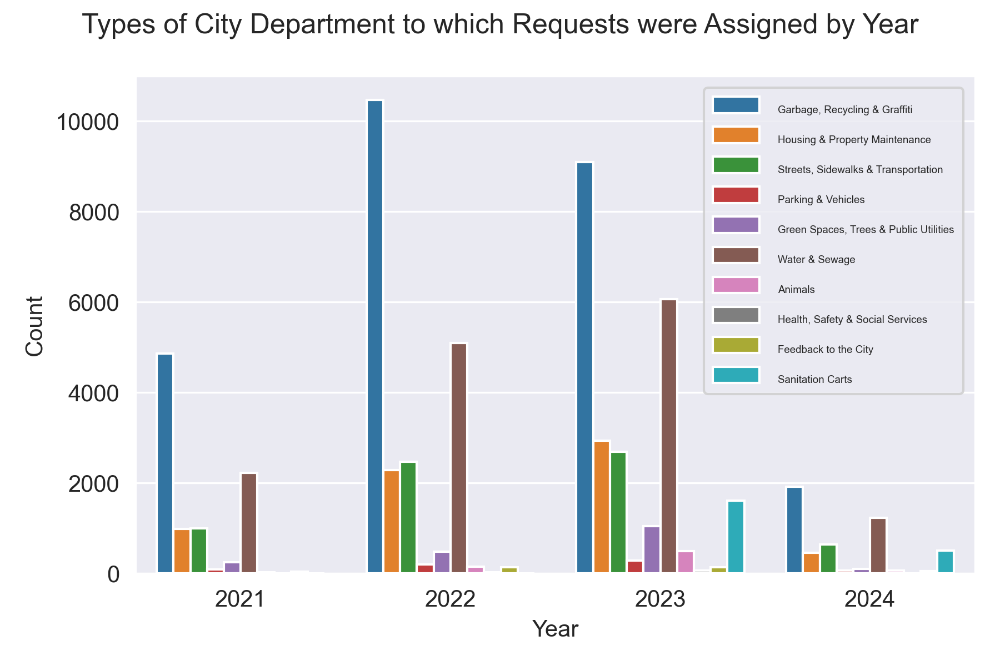
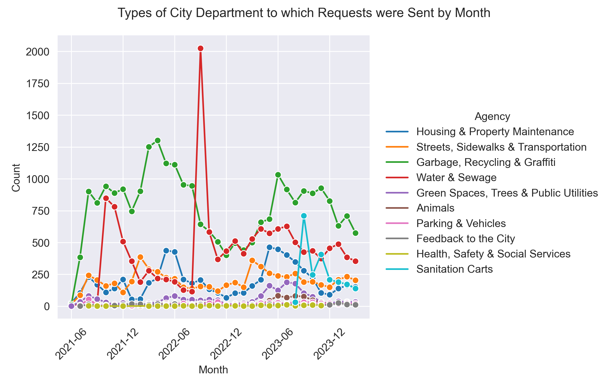
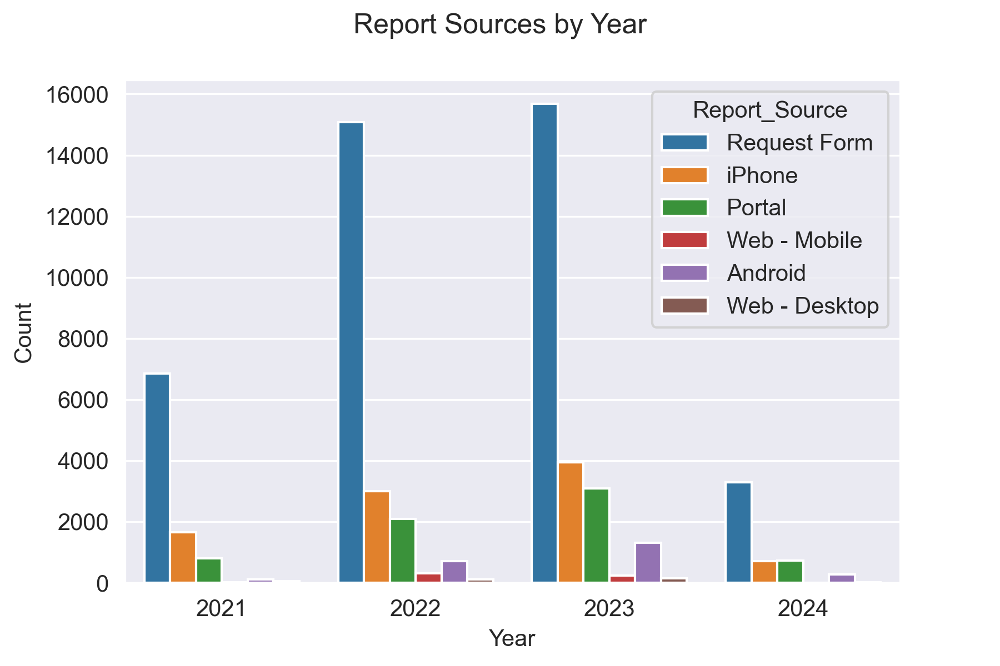
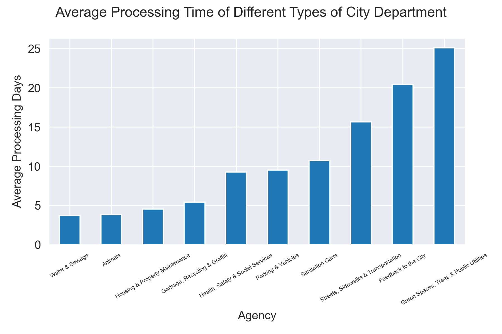
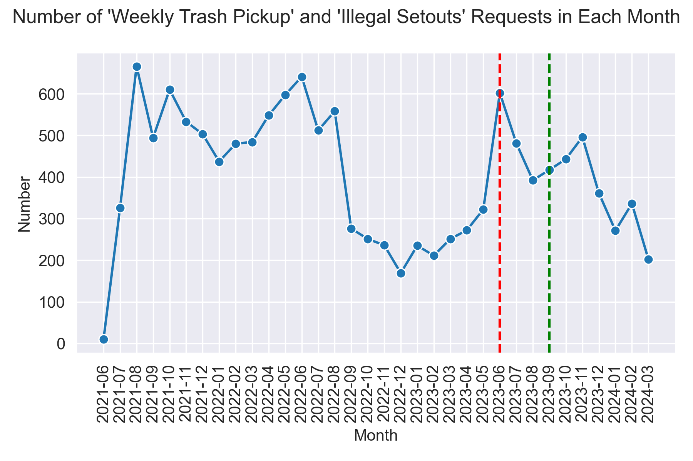
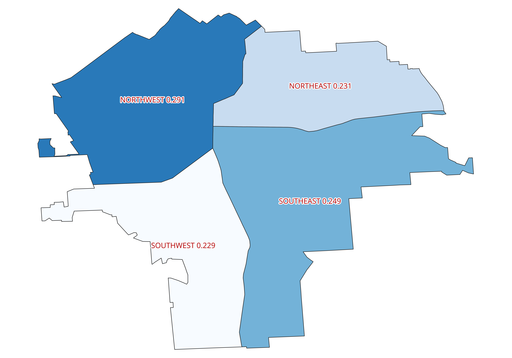

# An Analysis of SYRCityline Requests, 2021 to Present

## Introduction and Purpose

This is an analysis of SYRCityline Requests from 2021 to the present (as of April 2024). SYRCityline is an online platform for the residents of Syracuse to report non-emergency problems and request service from the city government. This gives residents more flexibility by providing an alternative to calling the city hotline directly.

Powered by SeeClickFix, residents can report their problems through a smartphone app or on the website portal. Once a user has submitted a service request, the system allows the user to check the progress of the request and provide feedback. An interactive map also allows users to locate the problems and increase the accuracy of the reports.

This project will focus on analyzing the nature of the requests and the efficiency of service delivery. SYRCityline informs policymakers about residents' foremost concerns. For example, residents can report on issues that are closely related to people's daily lives and well-being, such as water leaks, trash disposal, and potholes. Therefore, analyzing the SYRCityline requests enables the government to understand the pulse of the community and ensure the policies are adaptive to the immediate needs and concerns of the people. 

## Data and Input

This project uses data from the Syracuse Open Data portal. The Open Data program allows the public to download handy files containing data created or collected by the Syracuse government. 

### SYRCityline Requests Data

A CSV file that contains the information of resident services requests made since June 2021. The open data portal regularly updates the dataset. The dataset used for this analysis was generated on April 17, 2024, and contains the information of 60,208 requests. A shapefile is also used for mapping purposes. 

The request datasets were downloaded [here](https://data.syr.gov/datasets/0d58a53ccb22457990161d756ed8a870_0/explore).

### Syracuse Neighborhoods

A shapefile of the neighborhoods of Syracuse. It is used for mapping purposes. 

The neighborhoods shapefile was downloaded [here](https://data.syr.gov/datasets/4df344e3ad8f45a8b5625967c7b3bbe3_0/explore).

### Syracuse Quadrant

A shapefile of the quadrants of Syracuse. It is used for mapping purposes.

The quadrant shapefile was downloaded [here](https://data.syr.gov/datasets/0039ea50ceb649f099b17c52e1ff6fa8_0/explore?location=43.035368%2C-76.139400%2C12.52).

## Python Scripts and QGIS Project

Order: ```cleaning.py``` -> ```request.py``` -> ```quadrant.py``` -> ```request.qgz```

1. ```cleaning.py```

This script manipulates the raw dataset from the open data portal: renaming some columns and creating datetime columns for further analysis. It writes out the results to a new csv file called ```request.csv```.

2. ```request.py```

This script runs the new CSV file ```request.csv```, conducting data analysis and creating figures. 

3. ```quadrant.py```

This script cleans the column that contains quadrant information and writes out a CSV file ```percentage_by_quad.csv``` which provides information for further mapping.

4. ```request.qgz```

This is a QGIS project that creates two maps: ```request_map.png``` and ```quadrant_map.png```.

## Results

### Figures 1 and 2: Types of City Department to which Requests were Assigned by Year and Month





These figures show the number of requests agencies receive each year and each month. The general pattern has remained stable over time. The two types of agency that received the highest number of requests were "Garbage, Recycling & Graffiti" and "Water and Sewage". Therefore, we can reasonably infer that garbage management and water infrastructure have been the most salient issues for the people in Syracuse.

### Figure 3: Report Sources by Year



This figure shows the sources from which service requests were obtained. Across all years, the request form has consistently been the most common method through which residents report their requests. The result seems a little bit counterintuitive here. The availability of an app version on iOS and Android allows people to submit requests on their mobile phones; however, the traditional request form continues to be the predominant method.

### Figure 4: Average Processing Time of Different Types of City Department



This figure shows the average processing time of different types of city agency (in days). On average, "water & sewage" takes the least time while "green spaces, trees & public utilities" takes the longest. An interesting observation is that agencies processing requests in under 10 days typically involve issues that are necessities or crucial to people's daily lives, such as waste management and water/sewage maintenance; on the other hand, those that take more than 10 days tend to be less foremost issues that require more comprehensive intervention and construction, such as managing green spaces and public facilities.

### Figure 5: Number of "Weekly Trash Pickup" and "Illegal Setouts" Requests in Each Month



Analyzing SYRCityline requests can also provide insight into public policies at work. This figure shows the number of trash management-related requests before and after the new Syracuse Trash Cart program was put in place. The program standardizes the trash collection process in Syracuse. Residents have to use a specially designed trash cart that facilitates a semi-automatic pickup system for disposal. The goals of the program are to reduce worker injuries and create a more sanitized environment. 

Phase 1 of the program was launched in June 2023 when 20% of the trash collection routes were covered. From the figure, we can see that in June 2023 (represented by the red line), the number of requests related to "weekly trash pickup" and "illegal setouts" nearly doubled (approximately 600), compared to May 2023 (nearly 300). When the program was extended citywide in September 2023 (represented by the green line), although trash-related requests increased compared to the previous month, the magnitude was significantly smaller than that in June. This infers that people initially needed some time to get used to the new program; after the pioneer phase 1, people have been more prepared and informed. 

### Figure 6: Distribution of SYRCityline Requests


This map shows the geographical distribution of the SYRCityline Requests since June 2021. An interesting observation is that requests have been extremely rare in the campus of Syracuse University and the South Campus area.

### Figure 7: Quadrants



This map shows the distribution of SYRCityline requests by quadrants. A plurality (30%) of the requests were made in the Northwest Quadrant while the numbers in the other three quadrants are roughly similar.

## Acknowledgement

I would like to express my gratitude to Professor Peter J. Wilcoxen of the Maxwell School of Citizenship and Public Affairs at Syracuse University for his support and expertise.

Thank you for checking out my repository. Should you have any inquiries or feedback, please feel free to reach out to me at slam09@syr.edu.